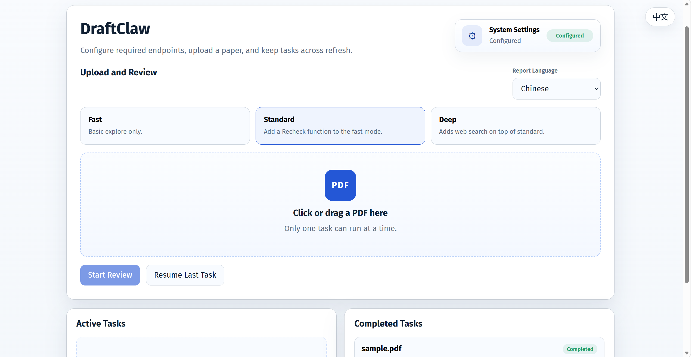
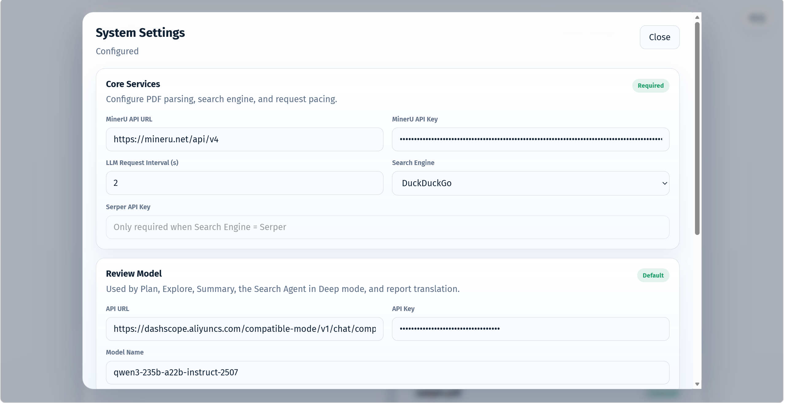

# DraftClaw: Catch the Flaws Before the Reviewers Do

<p align="center">
  
  
  
  
  
</p>

DraftClaw is a pre-review tool for academic papers and research documents. Before you submit your draft to reviewers, advisors, or collaborators, it helps surface the issues most likely to be called out.

## 🚀 Use Cases
- **Pre-submission paper check**: Identify potential issues in structure, argumentation, and writing before submitting to journals or conferences - **Thesis pre-submission check**: Conduct a comprehensive review before finalizing, minimizing major issues flagged by advisors or reviewers   
- **Grant application self-review**: Verify logical completeness and clarity before submission, reducing the risk of early-stage rejection  
- **Other formal research document reviews**: Applicable to academic and technical documents requiring external submission or internal evaluation  

## ✨ Highlights
- Chunk-level review pipeline with `fast / standard / deep` modes
- Search-aware verification for factual issues
- PDF bbox localization for issue positions
- Annotated PDF export with native PDF comments
- Persistent local task history and logs
- Built-in Web UI for upload, review, filtering, and export

## Example

### Example of Detection Results

#### [PDF Annotations](./example/Example_draftclaw_annotated.pdf) 
<small>Note: Please view with WPS or a PDF reader. Edge browser has poor support for annotations.</small>


#### [HTML Report](./example/Example_draftclaw_report.html)


### System Page

<!--#### Home


#### Settings


#### Detecction
-->


## ⚡ Quick Start

### 1. Install

```powershell
python -m venv .venv
.venv\Scripts\activate
python -m pip install --upgrade pip
python -m pip install -e .
```

### 2. Configure

```powershell
copy .env.example .env
```

### 3. Run

```powershell
draftclaw
```

By default, the app starts at:

```text
http://127.0.0.1:5000
```

Minimum required values:
```env
MINERU_API_URL=https://mineru.net/api/v4
MINERU_API_KEY=your_mineru_api_key

REVIEW_API_URL=https://dashscope.aliyuncs.com/compatible-mode/v1
REVIEW_API_KEY=your_review_api_key
REVIEW_MODEL=qwen3-235b-a22b-instruct-2507
```

Optional but commonly adjusted values:

```env
RECHECK_LLM_API_URL=https://dashscope.aliyuncs.com/compatible-mode/v1
RECHECK_LLM_API_KEY=your_recheck_llm_api_key
RECHECK_LLM_MODEL=qwen3-235b-a22b-instruct-2507

RECHECK_VLM_API_URL=https://dashscope.aliyuncs.com/compatible-mode/v1
RECHECK_VLM_API_KEY=your_recheck_vlm_api_key
RECHECK_VLM_MODEL=qwen3.5-plus-2026-02-15

SEARCH_ENGINE=duckduckgo
SERPER_API_KEY=
```

## 🧩 Review Modes

| Mode | Recheck | Web Search | Typical use |
| --- | --- | --- | --- |
| `fast` | off | off | fastest dry-run pass |
| `standard` | on | off | default paper review |
| `deep` | on | on | most thorough verification |

`Recheck` and `Web Search` are selected by review mode.

## 📤 Exports

### HTML Report

- interactive standalone HTML export
- issue list, filters, bbox overlays, and report metadata

### Annotated PDF

- red bbox markers locked to issue locations
- interactive comments for PDF readers that support annotations
- note popup contains full issue details when supported by the viewer

Each exported issue note includes:

- `Issues Type`
- `Description`
- `Reasoning`

## 📁 Project Structure

```text
.
|-- README.md
|-- .env.example
|-- pyproject.toml
|-- tests/
|-- draftclaw/
|   |-- agents/
|   |-- prompts/
|   |-- web/
|   |-- main.py
|   |-- config.py
|   |-- logger.py
|   |-- bbox_locator.py
|   |-- pdf_annotation_exporter.py
|   |-- report_export_renderer.py
|   `-- cli.py
`-- draftclaw.egg-info/
```

Important runtime data is written under `draftclaw/runtime/` and should not be committed.
