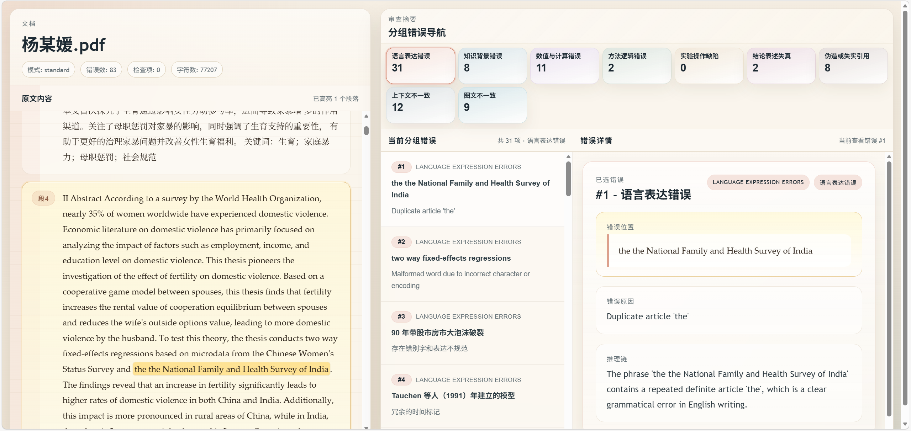

# DraftClaw: Catch the Flaws Before the Reviewers Do.

DraftClaw is a pre-review tool for academic papers and research documents. Before you submit your draft to reviewers, advisors, or collaborators, it helps surface the issues most likely to be called out.

Traditional document tools help you “see text.” DraftClaw focuses on helping you “see problems.” It parses your document and produces structured review results, enabling faster identification of critical flaws, reducing back-and-forth revisions, and making internal reviews more effective.

## ✨ Use Cases
- **Pre-submission paper check**: Identify potential issues in structure, argumentation, and writing before submitting to journals or conferences  
- **Grant application self-review**: Verify logical completeness and clarity before submission, reducing the risk of early-stage rejection  
- **Thesis pre-submission check**: Conduct a comprehensive review before finalizing, minimizing major issues flagged by advisors or reviewers  
- **Other formal research document reviews**: Applicable to academic and technical documents requiring external submission or internal evaluation  

## 🔍 Example

[Result Preview](./mode_result.html)



## 🚀 How to Use

### Option 1: Local Deployment with CLI

Best for centralized local deployment, batch processing, and managing all default parameters in a single configuration file.

#### 📦 1. Installation

```bash
git clone <your-repo-url>
cd DraftClaw
python -m venv .venv
.venv\Scripts\activate
pip install -e draftclaw
````

After installation, the `draftclaw` command will be available.

#### ⚙️ 2. Configuration

In CLI mode, default settings are defined in [default.yaml](./src/draftclaw/resources/configs/default.yaml). You can also configure them in the script [document_parser.py](./document_parser.py).

#### ⚡ 3. Run

You can run via **script** (recommended) or **CLI**.

##### 3.1 Run via Script

Refer to [document_parser.py](./document_parser.py). After completing **Installation** and **Configuration**, run:

```bash
python document_parser.py
```

##### 3.2 Run via CLI

Use the configuration in `default.yaml`:

```bash
draftclaw review
```

Override specific parameters temporarily:

```bash
draftclaw --working-dir output review --input ./test_pdf/whu.pdf --mode standard --run-name demo_review
```

Auxiliary commands:

```bash
draftclaw capabilities
draftclaw validate --result output\runs\20260320\run_xxx\final\mode_result.json
```

Results will be saved under `io.working_dir/runs/.../final/`, including:

* `mode_result.json`
* `mode_result.md`
* `mode_result.html`

---

### Option 2: Install via pip and Use in Script (Coming Soon)

Best for providing users with a script template where only the configuration section needs to be modified.

#### 📦 1. Installation

```bash
pip install draftclaw
```

#### ⚙️ 2. Configure Script

Refer to [document_parser.py](../document_parser.py) in the project root.

Minimal example:

```python
from pathlib import Path

from draftclaw import DraftClaw, ModeName, run_document

INPUT_FILE = Path("paper.pdf")
RUN_REVIEW = True
RUN_MODE = ModeName.STANDARD
RUN_NAME = "demo_review"

API_KEY = "your_api_key"
BASE_URL = "https://api.openai.com/v1"
MODEL = "gpt-4o-mini"

outcome = run_document(
    INPUT_FILE,
    review=RUN_REVIEW,
    mode=RUN_MODE,
    run_name=RUN_NAME,
    api_key=API_KEY,
    base_url=BASE_URL,
    model=MODEL,
)

if outcome.review is not None:
    print(DraftClaw.dump_result(outcome.review.result))
```

If you only want to parse the document without running a review:

```python
from draftclaw import parse_document, parse_document_text

document = parse_document("paper.pdf")
text = parse_document_text("paper.pdf")
```

## 🧩 Features

📄 **Document Processing**

* **Multi-format input**: Supports pdf, docx, txt, md, html/htm, pptx, adoc/asciidoc
* **Unified parsing**: Converts documents into structured text for analysis
* **Long document support**: Handles lengthy documents such as theses
* **Secure and reliable**: Supports local deployment for data privacy

📤 **Review & Output**

* **Structured results**: Outputs key results such as errorlist, error_groups, and final_summary
* **Multiple export formats**: Supports JSON, Markdown, and HTML (HTML recommended for full results)
* **Dual modes**:

  * fast: full-document quick scan, suitable for batch screening
  * standard: segmented, iterative review with merged results, suitable for formal pre-review

⚙️ **Usage Options**

* **CLI + Python API**: Can be used directly via command line or integrated into automated workflows

## 📁 Project Structure

```text
├─ draftclaw/                         # Main project directory
├─ src/draftclaw/                    # Core Python package source
│  ├─ cli.py                         # CLI entry point
│  ├─ api.py                         # Public high-level API
│  ├─ app.py                         # Application assembly (parser / mode / llm)
│  ├─ parser.py                      # Document parsing interface
│  ├─ settings.py                    # Configuration handling
│  ├─ _core/                         # Core configs, enums, exceptions, data structures
│  ├─ _runtime/                      # Runtime services and chunking
│  ├─ _modes/                        # fast / standard review modes
│  ├─ _llm/                          # LLM calls, caching, clients
│  ├─ _io/                           # File reading and parsing
│  ├─ _prompts/                      # Prompt construction
│  ├─ _postprocess/                  # Result deduplication and merging
│  ├─ _history/                      # Run artifacts and trace logging
│  └─ resources/                     # Default configs and prompt templates
├─ tests/                            # Test code
├─ document_parser.py                # Example entry (pip/script mode)
├─ README.md                         # Project documentation
├─ pyproject.toml                    # Package config, dependencies, CLI registration
└─ mode_result.html                  # Example result HTML
```

## 🤝 Development & Testing

```bash
pytest
```
