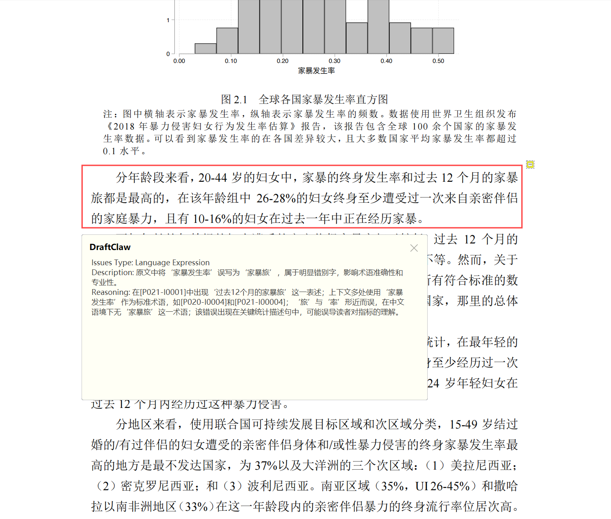
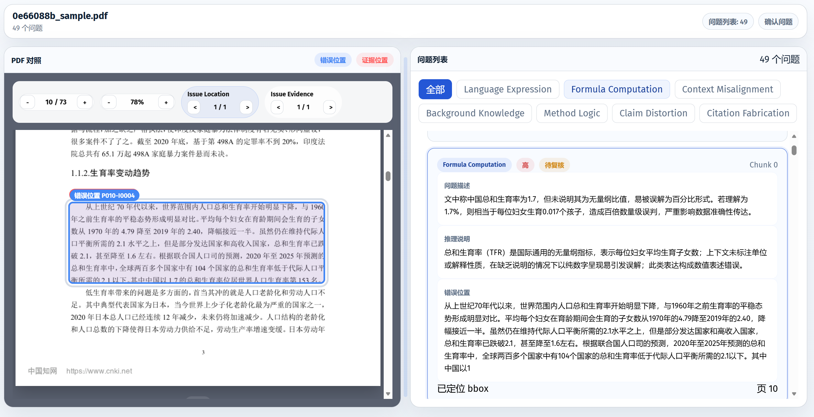
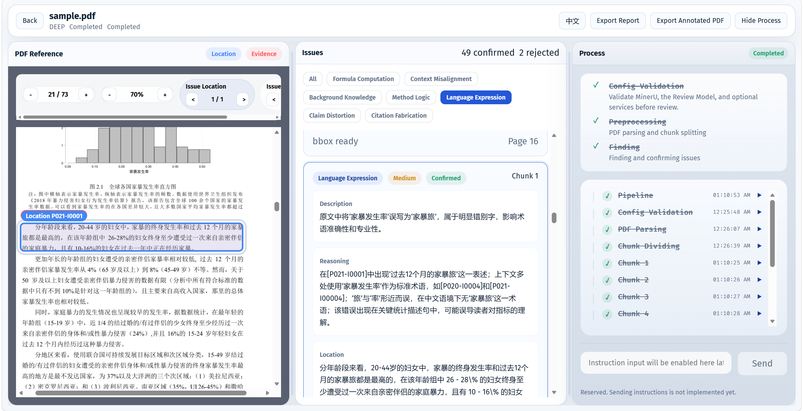
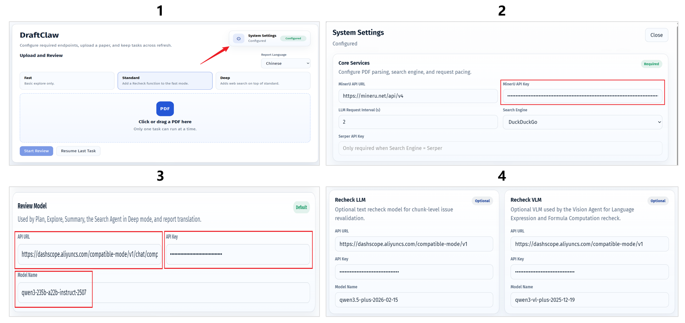

# DraftClaw：先于审稿人一步，发现稿件问题。

<p align="center">
  
  
  
  
  
</p>

<p align="center">
  <b>面向学术论文与研究文档的 AI 预审工具。</b><br>
  在审稿人、导师或合作者指出问题之前，提前发现结构、逻辑、写作与事实层面的缺陷。
</p>

---

**切换语言: [English](./README.md)**

## 什么是 DraftClaw？

**DraftClaw** 是一个面向学术写作的预审工具。  
在你提交论文、学位论文、基金申请书或任何正式研究文档之前，DraftClaw 会帮助你提前识别那些最容易在评审中被指出的问题。

与其等审稿人来发现稿件中的薄弱点，不如更早发现、更快修正，并以更高的把握提交。

---

## 适用场景

- **论文投稿前自查**  
  在投稿期刊或会议之前，发现结构、论证、表达清晰度与写作质量方面的问题。

- **学位论文提交前审阅**  
  在最终提交前做一次全面检查，降低导师或答辩委员会提出重大意见的概率。

- **基金申请自审**  
  在正式提交前检查逻辑完整性、写作质量和方案表述清晰度，减少早期被否的风险。

- **正式研究文档审阅**  
  同样适用于技术报告、白皮书、项目文档等需要严谨审阅的材料。

---

## 核心能力

- **写作质量检查**  
  识别表达生硬、歧义、不一致等语言问题，提升可读性与专业性。

- **知识与事实准确性检查**  
  发现背景知识、既有概念、引用内容与事实一致性方面的问题，降低错误陈述与无依据引用的风险。

- **逻辑与论证检查**  
  揭示论证链条、方法设计与结论有效性中的薄弱环节，包括推理断裂、推断错误和证据支撑不足。

- **研究与实验严谨性检查**  
  发现公式、计算、实验设置、评估设计以及跨章节一致性中的关键问题，这些问题可能影响研究结论的可靠性。

- **基于位置的精确报告**  
  将检测到的问题映射回 PDF 中的具体区域，让修改更快、更直接、更可执行。

---

## 示例

### 运行时间与 Token 成本

|  | 文档规模 | Deep 模式 | Standard 模式 | Fast 模式 |
|---|---|---|---|---|
| **学位论文** | 73 页 / 52k tokens | 45 分钟 / 1.2M tokens | 37 分钟 / 0.97M tokens | 30 分钟 / 0.67M tokens |
| **论文** | 12 页 / 12k tokens | 12 分钟 / 0.31M tokens | 9 分钟 / 0.23M tokens | 7 分钟 / 0.16M tokens |

以上结果基于 Advanced 配置测得。实际耗时与 Token 成本会随着所选基础模型不同而变化。

### 检测结果

以下以“武汉大学图书馆事件”当事女生的学位论文为例。

#### [PDF 批注文件](./example/Example_draftclaw_annotated.pdf)（请下载后查看）

> [!CAUTION]
> 说明：为了获得更好的批注显示效果，建议使用 WPS 或专业 PDF 阅读器打开。Edge 对批注的支持较为有限。



#### [HTML 报告](./example/Example_draftclaw_report.html)（请下载后查看）



### 系统页面



---

## 快速开始

### 1. 安装

假设本机已安装 `Python 3.10+`，以下命令涵盖了从 `git clone` 到进入配置前的全部步骤。

```powershell
git clone https://github.com/Fang7no/DraftClaw.git
cd DraftClaw
python -m venv .venv
.venv\Scripts\activate
python -m pip install --upgrade pip
python -m pip install -e .
```

### 2. 配置

```powershell
copy .env.example .env
```

### 3. 运行

```powershell
draftclaw
```

### 浏览器访问

默认启动地址为：

```text
http://127.0.0.1:5000
```

---

## 配置说明

完成以下配置后，你可以使用 [test_paper](./test_paper.pdf) 做一次快速测试。



### 1. 打开系统设置

启动系统后，点击 **System Settings** 进入配置页面。

### 2. 核心服务（必填）

这些是系统运行所依赖的基础服务，必须优先配置。

#### PDF 解析

用于解析并结构化学术 PDF 文档。

- 前往 [MinerU](https://mineru.net/) 注册并获取 **API Key**
- **完全免费**

#### 网络搜索

用于外部知识检索与事实核验。

- **默认选项**：DuckDuckGo  
  开箱即用，且 **完全免费**
- **高级选项**：[Serper](https://serper.dev/)  
  注册后可获得带 **免费额度** 的 **API Key**

### 3. Review Model（必填）

Review Model 是系统的核心模型，负责主要的论文审阅与问题检测流程。

- **Starter**：`qwen3-235b-a22b-instruct-2507`
- **Advanced**：`gpt-5.4-2026-03-05`

### 4. Recheck Model（仅 Standard / Deep 模式必填）

在 **Standard** 和 **Deep** 模式下，系统会执行第二轮复核，因此还需要配置 Recheck Model。

**Recheck LLM**：用于复核并重新评估初次审阅结果。

- **Starter**：`qwen3.5-plus-2026-02-15`
- **Advanced**：`Gemini 3.1 Pro`

**Recheck VLM**：用于图像、版式、截图等视觉证据的复核。

- **Starter**：`qwen3-vl-plus-2025-12-19`
- **Advanced**：`Gemini 3 Flash`

### 配置建议

为了获得更好的审稿质量，建议采用以下策略：

- **Review Model**：优先选择你所在平台提供的 **最强官方模型**
- **Recheck LLM**：尽量选择与 Review Model **不同家族** 的模型，以减少同模型偏差
- **Recheck VLM**：优先选择 **最强官方视觉语言模型**

你也可以根据预算、速度和可用性自行选择。

### API Key 获取渠道

不同模型家族的 API Key 可以从以下平台获取：

- **Qwen 系列模型**：前往 [DashScope](https://dashscope.console.aliyun.com/) 申请，**有免费额度**
- **GPT 系列模型**：前往 [OpenAI](https://platform.openai.com/) 申请，**付费**
- **Gemini 系列模型**：前往 [Google AI Studio](https://aistudio.google.com/) 申请，**付费**

---

## 审阅模式

| 模式 | Recheck | Web Search | 典型用途 |
| ---------- | ------- | ---------- | ------------------------------- |
| `fast`     | off     | off        | 最快的快速试跑审阅 |
| `standard` | on      | off        | 默认学术稿件审阅 |
| `deep`     | on      | on         | 最全面的核验流程 |

> `Recheck` 和 `Web Search` 会根据所选审阅模式自动启用或关闭。

---

## 导出结果

### HTML 报告

* 独立的交互式 HTML 导出文件
* 支持筛选的问题列表
* 问题位置对应的 bbox 覆盖层
* 便于追溯的审阅元数据

### 标注 PDF

* 与问题位置对齐的红色 bbox 标记
* 在支持的阅读器中可显示原生 PDF 批注
* 如果阅读器支持，可在批注弹窗中查看完整问题详情

### 每条导出问题包含

* `Issues Type`
* `Description`
* `Reasoning`

---

## 典型工作流程

1. 通过 Web UI 上传待检查的 PDF 稿件
2. 选择审阅模式：`fast`、`standard` 或 `deep`
3. 运行整套审阅流程
4. 在界面中查看检测出的问题
5. 将结果导出为 **HTML 报告** 或 **标注 PDF**
6. 在正式提交前完成修订

---

## 项目结构

```text
.
|-- README.md
|-- .env.example
|-- pyproject.toml
|-- tests/
|-- draftclaw/
|   |-- agents/
|   |-- prompts/
|   |-- web/
|   |-- main.py
|   |-- config.py
|   |-- logger.py
|   |-- bbox_locator.py
|   |-- pdf_annotation_exporter.py
|   |-- report_export_renderer.py
|   `-- cli.py
`-- draftclaw.egg-info/
```

---

## 说明

重要运行数据会写入：

```text
draftclaw/runtime/
```

---

## 愿景

DraftClaw 的目标，是成为正式提交前的最后一道质量关卡：  
它不是替代真实审稿人的工具，而是一个实用的 AI 预审助手，帮助研究者在稿件进入正式评审之前，先把表达、严谨性与整体质量提升到更稳妥的状态。
